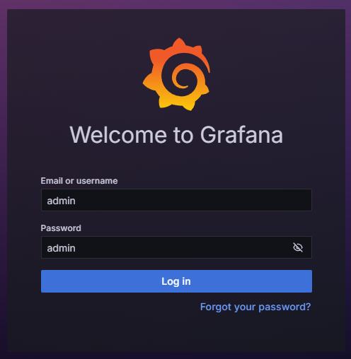
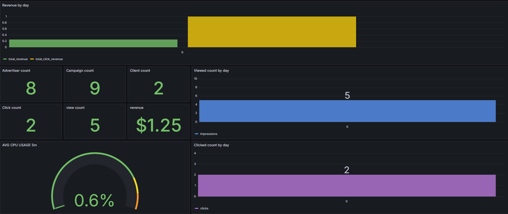
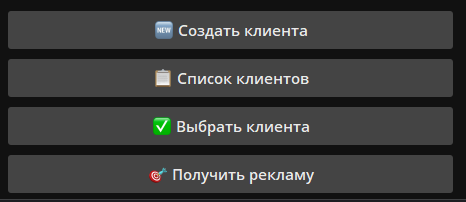
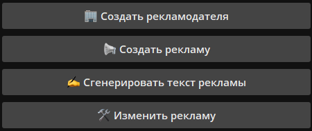
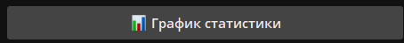
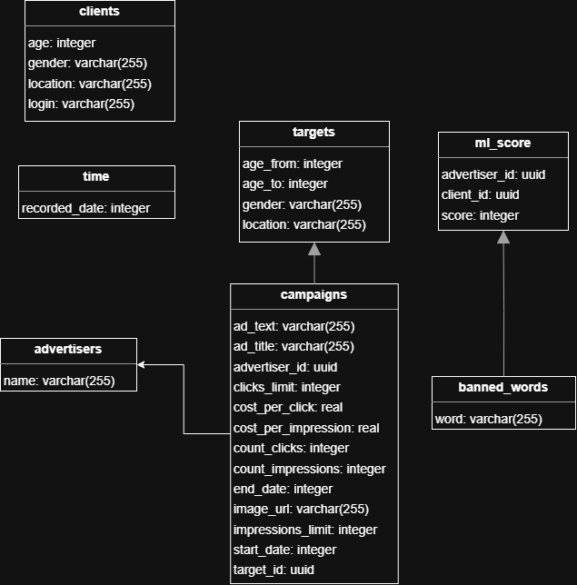
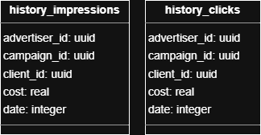

# PROD Backend 2025 Рекламная платформа

## Запуск приложения

### Требования

- Docker
- Docker Compose

### Установка и запуск

1. Клонируйте репозиторий:

    ```bash
    git clone git@gitlab.prodcontest.ru:2025-final-projects-back/Sirnilin.git
    cd Sirnilin/solution
    ```

2. Запустите приложение с помощью Docker Compose:

    ```bash
    docker-compose up --build
    ```

### Конфигурация

- Убедитесь, что все необходимые переменные окружения установлены.
- Проверьте конфигурационные файлы для корректной настройки.

### Использование

#### Основные методы

Приложение будет доступно по адресу `http://localhost:8080`.

1. Создание клиентов, для этого нужно отправить POST запрос на `http://localhost:8080/client/bulk` с телом:

    ```json
    [
        {
        "client_id": "3fa85f64-5717-4562-b3fc-2c963f66afa6",
        "login": "string",
        "age": 0,
        "location": "string",
        "gender": "MALE"
        }
    ]
2. Создание рекламодателей, для этого нужно отправить POST запрос на `http://localhost:8080/advertiser/bulk` с телом:

   ```json
   [
     {
     "advertiser_id": "3fa85f64-5717-4562-b3fc-2c963f66afa6",
     "name": "string"
     }
   ]
3. Создание рекламных кампаний, для этого нужно отправить POST запрос на `http://localhost:8080/advertisers/{advertiserId}/campaigns` с телом:

    ```json
    {
     "impressions_limit": 0,
     "clicks_limit": 0,
     "cost_per_impression": 0,
     "cost_per_click": 0,
     "ad_title": "string",
     "ad_text": "string",
     "start_date": 0,
     "end_date": 0,
     "targeting": {
         "gender": "MALE",
         "age_from": 0,
         "age_to": 0,
         "location": "string"
         }
     }
4. Задать Ml-Score для клиента, для этого нужно отправить POST запрос на `http://localhost:8080/ml-score` с телом:

   ```json
   {
   "client_id": "3fa85f64-5717-4562-b3fc-2c963f66afa6",
   "advertiser_id": "3fa85f64-5717-4562-b3fc-2c963f66afa6",
   "score": 0
   }
5. Получение клиентом рекламы, для этого нужно отправить GET запрос на `http://localhost:8080/ads` с параметрами:

   ```json
   client_id="UUID клиента, запрашивающего показ объявления."
   ```
6. Клиент кликает на рекламу, для этого нужно отправить POST запрос на `http://localhost:8080/ads/{adId}/click` с телом:

   ```json
   {
   "client_id": "3fa85f64-5717-4562-b3fc-2c963f66afa6"
   }
### Дополнительные фичи

#### Модерация текстов рекламы
Для того чтобы настроить модерацию текстов рекламы, нужно добавить список запрещенных слов через 
POST запрос на `http://localhost:8080/banned-words/add` с телом:

```json
[
    "слово1",
    "слово2",
    "слово3"
]
```
Теперь, чтобы создавать рекламные кампании с модерацией текста и названия, нужно использовать 
POST запрос на `http://localhost:8080/advertisers/{advertiserId}/campaigns/V2`. 

Для обновления информации о рекламной кампании с модерацией текста и названия, нужно использовать
PUT запрос на `http://localhost:8080/advertisers/{advertiserId}/campaigns/{campaignId}/V2`.

Для того чтобы удалить список запрещенных слов, нужно использовать DELETE запрос на `http://localhost:8080/banned-words/remove` с телом:

```json
[
    "слово1",
    "слово2",
    "слово3"
]
```

#### Загрузка изображений для рекламных кампаний
Для каждой рекламы можно загрузить изображение. Для этого нужно отправить POST 
запрос на `http://localhost:8080/advertisers/{advertiserId}/campaigns/{campaignId}/uploadImage` с параметром `file`, содержащим изображение.

Получить изображение можно по ссылке, которая находится в теле объекта рекламы в поле image_url. Для этого можно 
использовать GET запрос на `http://localhost:8080/advertisers/{advertiserId}/campaigns/{campaignId}`.

Для удаления изображения нужно отправить DELETE запрос на `http://localhost:8080/advertisers/{advertiserId}/campaigns/{campaignId}/removeImage`.

#### Статистика
Посмотреть Dashboard статистики приложения можно по адресу `http://localhost:3000`.

1. Для входа в Grafana используйте логин `admin` и пароль `admin`.

2. Далее нажмите skip и слева выберите `Dashboard`. 
3. На dashboard вы увидите основную статистику по количеству клиентов, рекламодателей, кампаний,
кликов, показов и прибыль приложения.


Также рекламодатель может получить статистику по своим кампаниям. Для этого есть несколько специальных GET запросов:
1. Получить статистику по заданной кампании: `http://localhost:8080/stats/campaigns/{campaignId}`
2. Получить статистику по всем кампаниям рекламодателя: `http://localhost:8080/stats/advertisers/{advertiserId}/campaigns`
3. Получить статистику по дням для заданной кампании: `http://localhost:8080/stats/campaigns/{campaignId}/daily`
4. Получить статистику по дням для всех кампаний рекламодателя: `http://localhost:8080/stats/advertisers/{advertiserId}/campaigns/daily`

#### LLM генерация текста для рекламной кампании
Рекламодатель может сгенерировать текст для рекламной кампании с помощью LLM модели. Для этого нужно отправить POST запрос на `http://localhost:8080/generateAdText` с телом:

```json
{
    "campaign_description": "string"
}
```

#### Интеграция с Telegram ботом

Протестировать и посмотреть на функционал приложения можно через Telegram бота - `@ads_prod_individual_bot`

Для того чтобы начать работу с ботом, нужно отправить команду `/start`. Далее бот предложит вам выбрать роль - клиент или рекламодатель.

Роль всегда можно сменить, отправив еще раз команду `/start` и выбрав другую роль.

Выбрав роль клиента, вы сможете создать клиентов, получить список,
созданных клиентов, выбрать клиента и посмотреть от его лица рекламу.


Выбрав роль рекламодателя, вы сможете создать рекламодателя, рекламу, сгенерировать текст для нее, изменить ее значения
и посмотреть статистику рекламодателя.



### Архитектура приложения
Приложение разбито на 2 микросервиса: `backend` и `statistics`. Сделано это для того, чтобы разделить логику приложения и 
ускорить его в момент расчета рекламы для клиента. Основная логика приложения находится в `backend`. Здесь обрабатываются все
запросы, связанные с созданием клиентов, рекламодателей, рекламных кампаний, получением рекламы клиентом, кликами на рекламу и тд.

Прикладываю схему базы данных `backend` приложения.


`Statistics` микросервис отвечает за сбор статистики, подсчет кликов и показов рекламы, а также за их сохранение в бд.

Прикладываю схему базы данных `statistics` приложения.


Основная логика использования микросервисной архитектуры заключается в том, что приложение как можно лучше выдерживало 
нагрузку при получении рекламы клиентами.

При попытки получить клиентом рекламу происходит следующая логика(аналогично происходит и при клике на рекламу):


